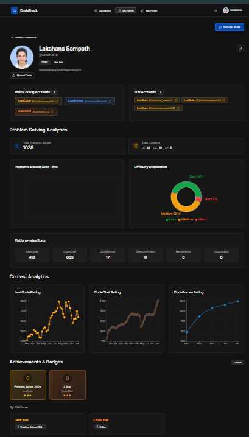
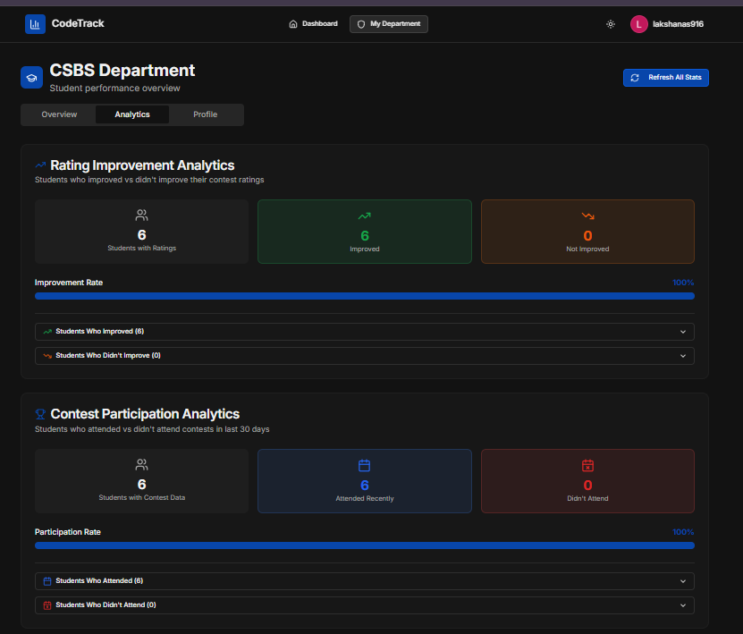
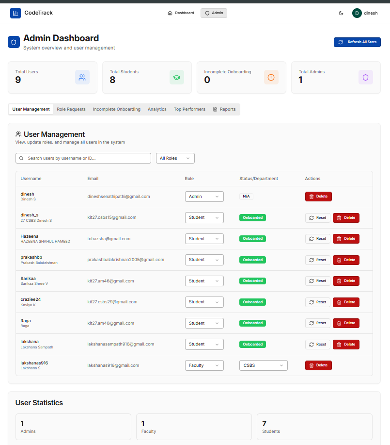

# Student Coding Performance Analytics Platform

A full-stack web application that tracks and analyzes student coding performance across multiple competitive programming platforms (LeetCode, CodeChef, CodeForces).

## 📸 Screenshots

> **Note**: Place your screenshot images in the `screenshots/` folder with the following names:
> - `student-profile.png` - Student profile dashboard screenshot
> - `faculty-analytics.png` - Faculty analytics dashboard screenshot  
> - `admin-dashboard.png` - Admin dashboard screenshot

### Student Profile Dashboard

*Comprehensive student profile showing coding accounts, problem-solving analytics with difficulty distribution, platform-wise statistics, contest rating trends across multiple platforms, and achievement badges.*

### Faculty Analytics Dashboard

*Faculty dashboard displaying department-wide analytics including rating improvement tracking, contest participation metrics, and detailed student performance comparisons with expandable lists.*

### Admin Dashboard

*Administrative interface for user management with role assignment, onboarding status tracking, user statistics, and bulk operations for managing students, faculty, and administrators.*

## Features

### 👤 User Management
- **Google OAuth Authentication**: Secure login with Google accounts
- **Role-Based Access Control**: Student, Faculty, and Admin roles with specific permissions
- **Profile Picture Upload**: Cloudinary-powered image uploads with automatic optimization
- **Onboarding Flow**: Guided setup for new users to connect coding platform accounts

### 📊 Student Analytics
- **Multi-Platform Integration**: Track performance across LeetCode, CodeChef, and CodeForces
- **Problem Solving Stats**: Total problems solved with difficulty breakdown (Easy, Medium, Hard)
- **Contest Analytics**: Rating progression charts and contest participation tracking
- **Achievement Badges**: Automated badge system for milestones and accomplishments
- **Platform-wise Statistics**: Detailed breakdown of problems solved per platform

### 🎓 Faculty Dashboard
- **Department Overview**: View all students in assigned department
- **Performance Analytics**: Track student improvement and contest participation
- **Rating Improvement Tracking**: Identify students who improved vs. those who need support
- **Contest Participation Metrics**: Monitor which students are actively participating
- **Bulk Data Refresh**: Update all student data with a single click

### 🛡️ Admin Panel
- **User Management**: Create, update, and delete user accounts
- **Role Assignment**: Change user roles and assign departments to faculty
- **Onboarding Management**: Reset onboarding status and track incomplete profiles
- **Role Requests**: Approve or reject faculty/admin role requests
- **System Analytics**: View overall platform statistics and top performers
- **Bulk Operations**: Refresh all student data across the platform

### 🔄 Automated Data Scraping
- **Real-time Updates**: Automated scraping of coding platform data
- **Multiple Platform Support**: LeetCode, CodeChef, and CodeForces integration
- **Error Handling**: Robust scraping with retry logic and error reporting
- **Progress Tracking**: Monitor scraping progress for bulk operations
- **Weekly Snapshots**: Automated weekly data snapshots for historical tracking

## Tech Stack

### Frontend
- **React 18** - Modern UI library with hooks
- **TypeScript** - Type-safe development
- **Vite** - Fast build tool and dev server
- **Tailwind CSS** - Utility-first CSS framework
- **shadcn/ui** - Beautiful, accessible component library
- **Recharts** - Composable charting library
- **React Query** - Data fetching and caching
- **Wouter** - Lightweight routing

### Backend
- **Node.js** - JavaScript runtime
- **Express** - Web application framework
- **TypeScript** - Type-safe server code
- **Passport.js** - Authentication middleware
- **Google OAuth 2.0** - Secure authentication

### Database & Storage
- **MongoDB** - NoSQL database for flexible data storage
- **Mongoose** - MongoDB object modeling
- **Cloudinary** - Cloud-based image storage and optimization

### Web Scraping
- **Puppeteer** - Headless browser automation
- **Cheerio** - Fast HTML parsing
- **Custom Scrapers** - Platform-specific data extraction

### DevOps & Tools
- **Git** - Version control
- **npm** - Package management
- **ESLint** - Code linting
- **Prettier** - Code formatting

## Quick Start

1. **Install dependencies**
   ```bash
   npm install
   ```

2. **Set up environment variables**
   ```bash
   cp .env.example .env
   ```
   
   Edit `.env` with your credentials:
   - MongoDB connection strings (main and admin databases)
   - Google OAuth credentials (Client ID, Client Secret, Callback URL)
   - Session secret for JWT tokens
   - Cloudinary credentials (Cloud Name, API Key, API Secret)

3. **Start development server**
   ```bash
   npm run dev
   ```
   
   The application will be available at:
   - Frontend: `http://localhost:5000`
   - Backend: `http://localhost:5005`

4. **Create an admin user** (Optional)
   ```bash
   npm run make-admin
   ```

## Scripts

- `npm run dev` - Start development server
- `npm run build` - Build for production
- `npm run start` - Start production server
- `npm run db:scrape` - Scrape all student data
- `npm run make-admin` - Create admin user

## Documentation

- [Quick Start Guide](QUICK_START.md) - Get up and running in 5 minutes
- [Scraper Documentation](SCRAPER_README.md) - Detailed scraping system docs
- [Troubleshooting](TROUBLESHOOTING.md) - Common issues and solutions

## License

MIT